# Email Automation Jev

A Gmail-to-job-tracker workspace built around [TypeSafe Jev](https://typesafe.ai/). It ingests incoming and sent Gmail messages, classifies job-search events with typed probabilities, groups related messages into applications, and presents the result through an operational dashboard.

The project separates three kinds of intelligence:

- deterministic code owns Gmail synchronization, database writes, grouping rules, safety, and workflow execution;
- Jev supplies fast typed judgments for classification, relationships, routing, and identity selection;
- GPT-4o Mini is used only for bounded second-stage review, reply drafting, and NL-to-SQL answers.

## Current status

The complete local workflow is operational:

- incremental and resumable Gmail ingestion;
- eight-way Jev email classification plus uncertainty policy;
- manual labeling and held-out evaluation;
- fresh or history-preserving full-mailbox runs;
- application grouping with reused-thread edge-case handling;
- horizontal Kanban boards, analytics, Sankey, and Jev performance lab;
- human corrections, durable stars, AI Brain review, and reply drafts;
- probabilistic company/title resolution;
- Jev-routed read-only AI Chat;
- optional Redis snapshots and hourly orchestration.

The active classifier is `job-email-jev-v6`. Candidate/application/interview feedback surveys are `other`; required EEO, WOTC, eligibility, profile, or missing-detail forms are `information_needed`.

## System overview

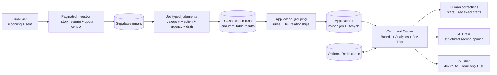

## Phase map

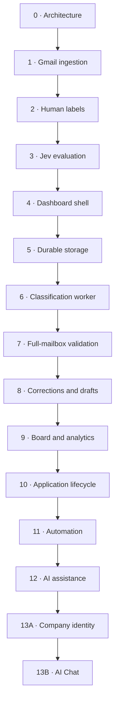

## Quick start

### Requirements

- Node.js 20 or newer
- a Google Cloud OAuth client with Gmail API access
- a Supabase Postgres project
- a TypeSafe API key
- an OpenAI API key for optional AI Brain, reply drafting, and AI Chat
- an optional hosted Redis URL for shared snapshot caching

### Install and configure

```bash
npm ci
cp .env.example .env
```

Fill the required values in `.env`:

```dotenv
SUPABASE_URL=https://your-project.supabase.co
SUPABASE_SERVICE_ROLE_KEY=replace_me
GMAIL_CLIENT_ID=replace_me.apps.googleusercontent.com
GMAIL_CLIENT_SECRET=replace_me
TYPESAFE_API_KEY=replace_me
OPENAI_API_KEY=replace_me
```

Apply the SQL files in `supabase/migrations/` in filename order. The missing `009` is intentional: the proposed RAG/vector phase was retired before migration and replaced by bounded NL-to-SQL.

### Authenticate, ingest, classify, and publish

```bash
npm run gmail:auth
npm run ingest:full
npm run classify -- --scope all
npm run applications:group
npm run dashboard
```

Open `http://127.0.0.1:4173` unless `LABELING_UI_PORT` selects another port.

For normal use after the first build, open **Command Center** and run:

1. **Sync Gmail** — resumes from Gmail history rather than rescanning everything.
2. **Classify with Jev** — choose new emails or the entire mailbox.
3. **Publish outputs** — rebuilds applications and refreshes boards, AI Brain, and analytics.

## Classification contract

| Category | Meaning |
| --- | --- |
| `applied` | Application submitted, received, or still under review |
| `outreach` | Candidate-initiated cold contact or follow-up |
| `reply_needed` | A written email/message response is required |
| `information_needed` | Required administrative candidate information such as EEO, WOTC, eligibility, authorization, profile, or missing details |
| `interview_assessment` | Interview, scheduling, screening, test, case study, take-home, or evaluative assessment |
| `offer` | Explicit offer or offer-finalization evidence |
| `rejected` | Explicit rejection or closed role |
| `other` | Non-job mail, marketing, security, delivery failures, or candidate/interview feedback surveys |

`uncertain` is not a competing Jev category. Application policy emits it when the winning probability is below `JEV_MIN_TOP_PROBABILITY`.

`ghosted` is application-level derived state, not a single-email classification. It requires an established conversation with at least three messages across both directions, an unanswered outgoing final message, and the configured waiting period. Cold outreach and standalone applications never become ghosted merely because no one replied.

## Phase-by-phase implementation

### Phase 0 — Architecture and boundaries

The project began with a relational system of record and kept semantic judgment separate from execution.

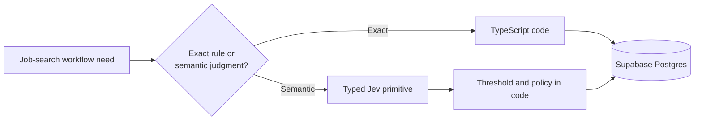

Key decision: Pinecone is not the primary database. The mailbox is relational, the corpus is small for Postgres, and current AI questions are served through safe SQL rather than embeddings.

### Phase 1 — Gmail ingestion

Gmail ingestion includes Inbox, Sent, Spam, and Trash while excluding Drafts. A full scan paginates every result; normal synchronization resumes from Gmail history.

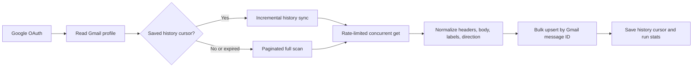

Commands:

```bash
npm run gmail:auth
npm run ingest
npm run ingest:full
npm run ingest:resume
npm run inspect
```

### Phase 2 — Human labels and evaluation data

Manual labels are private development/evaluation evidence; they are not dumped into every Jev request.

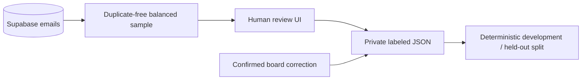

Commands:

```bash
npm run sample:emails
npm run dashboard
npm run jev:prepare
```

Generated samples and labels under `data/labeling/generated/` are ignored by Git because they contain private email content.

### Phase 3 — Jev classifier and benchmark

One TypeSafe request asks four independent questions over the same normalized email state.

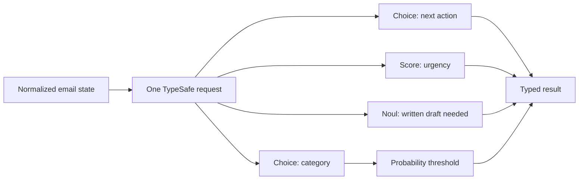

Commands:

```bash
npm run jev:evaluate
npm run jev:evaluate:all
```

The held-out result is the release gate. The all-label run is diagnostic because it includes development examples. The benchmark UI always marks reports from older classifier versions as stale.

### Phase 4 — Dashboard shell

The prototype labeling screen became one application with stable top-level navigation and contextual sub-navigation.

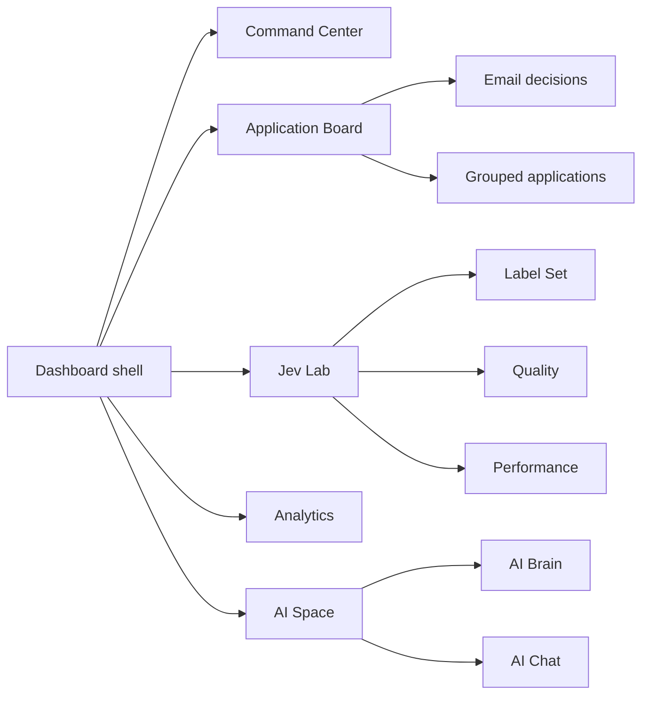

Command:

```bash
npm run dashboard
```

### Phase 5 — Durable classification storage

The classification core intentionally remains small.

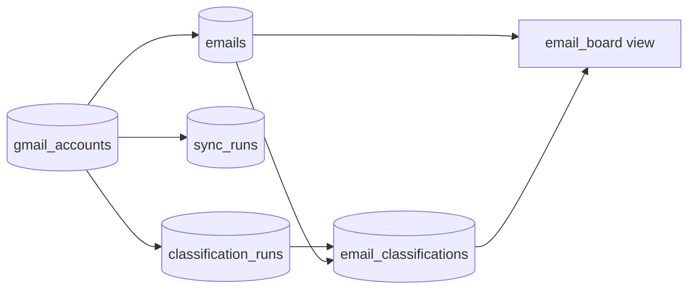

Human corrections are current columns on `emails`; completed Jev rows remain immutable during ordinary operation. Browser roles cannot read these tables directly. Server code uses the Supabase service role.

Command:

```bash
npm run phase5:bootstrap
```

### Phase 6 — Classification worker and Command Center

The worker is durable, resumable, bounded, and version-aware. Command Center exposes both scope and replacement policy.

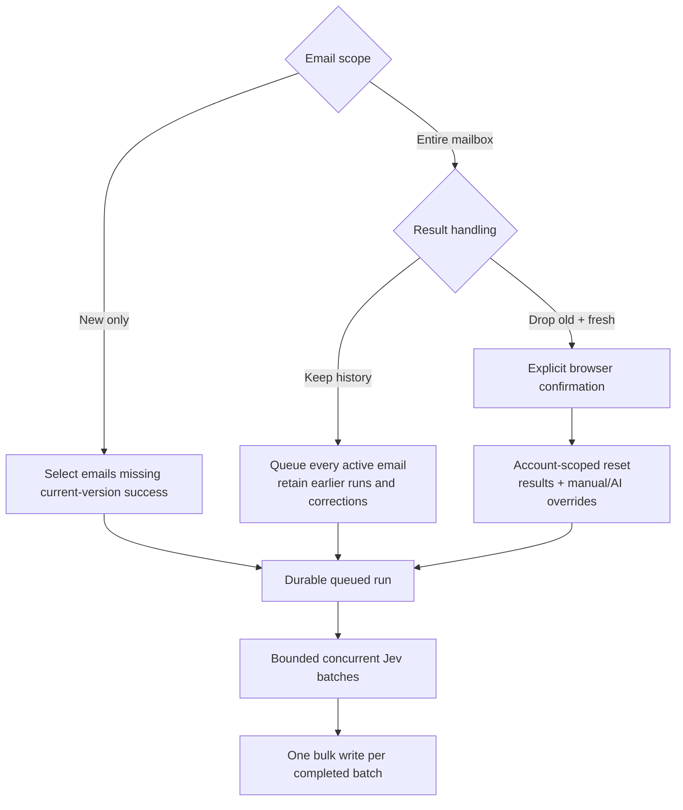

CLI examples:

```bash
# Normal incremental run
npm run classify -- --scope unclassified

# Deliberate clean full-mailbox rebuild
npm run classify -- --scope all
```

For safety, destructive full scope rejects `--limit`, `--after`, `--before`, and explicit email IDs. It preserves source emails, private label JSON, drafts, and star anchors.

### Phase 7 — Full-mailbox validation and performance

Jev Lab Performance measures provider time separately from application overhead without changing production data.

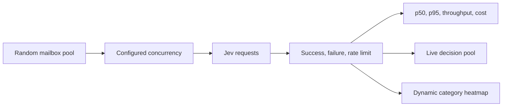

Battleground runs are disposable timing experiments. Production classification uses durable runs and database persistence.

### Phase 8 — Corrections and reply drafts

Human judgment never overwrites the historical Jev output. Draft generation is restricted to effective `reply_needed` decisions and never sends mail.

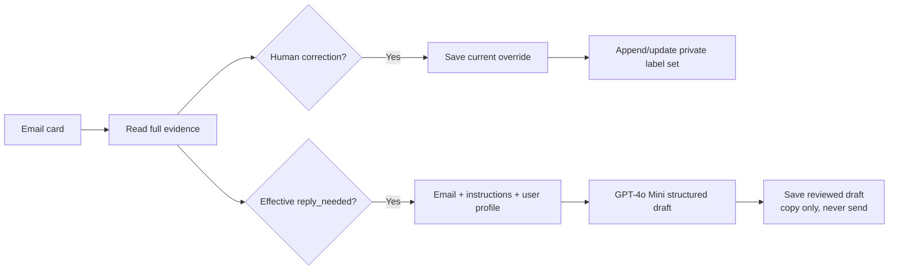

### Phase 9 — Email Board and analytics

Email decisions feed a horizontal Kanban and cached analytics views.

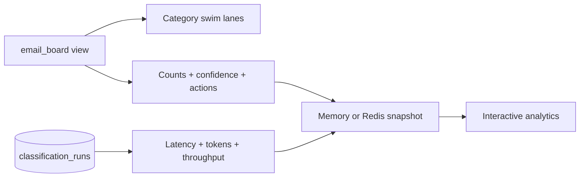

The board loads lane pages independently. Analytics supports 30, 60, 90 days, or all-time views and rebuilds snapshots after publication.

### Phase 10 — Application grouping and lifecycle

A Gmail thread is evidence, not an application identity. Deterministic rules handle strong matches/conflicts; ambiguous same-thread pairs use a bounded Jev Noul relationship judgment.

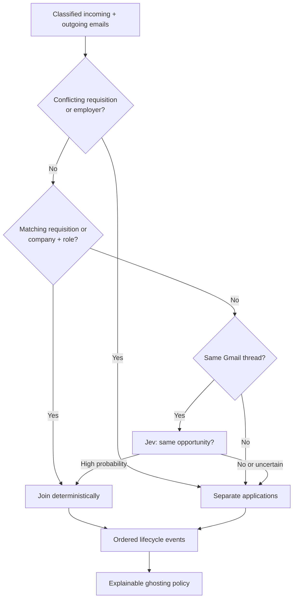

Command:

```bash
npm run applications:group
```

Application tables are limited to `applications`, `application_messages`, and `application_status_events`.

### Phase 11 — Scheduling and observability

The scheduled pipeline is incremental and protected by an account-scoped lease.

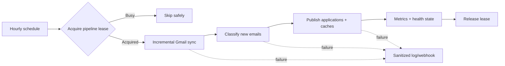

Commands:

```bash
npm run automate:once
npm run scheduler
```

Health endpoint: `GET /api/operations/health`.

### Phase 12 — AI Brain, relationships, drafts, and stars

AI Brain is an advisory second stage for high-value lanes. Jev and human decisions remain independently inspectable.

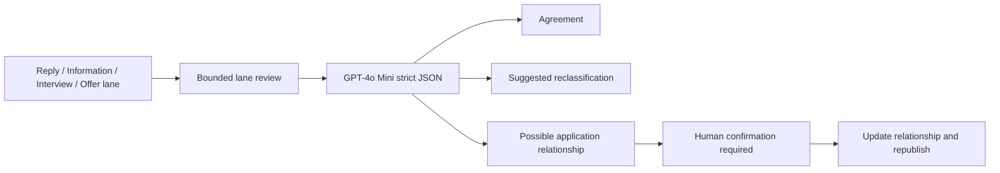

Durable stars use an email-level anchor rather than trusting a derived application row:

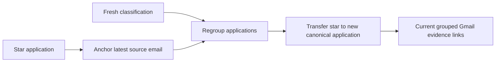

Command for a bounded reviewer evaluation:

```bash
npm run ai:evaluate -- --limit=20
```

### Phase 13A — Probabilistic company and title identity

Candidate strings come from code; Jev chooses among bounded candidates and may select `none`. Staging never silently changes production identities.

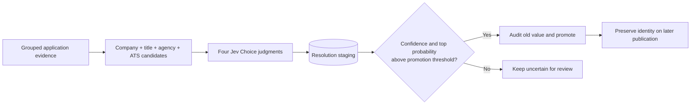

Commands:

```bash
npm run companies:resolve -- --limit 50 --concurrency 10 --batch-size 50
npm run companies:resolve
npm run companies:promote -- --threshold=0.90
```

The resolver excludes `other` and retains complete probability distributions for company and title separately.

### Phase 13B — Jev-routed NL-to-SQL AI Chat

Jev decides whether a database tool is needed. Only mailbox-data questions reach the SQL generator.

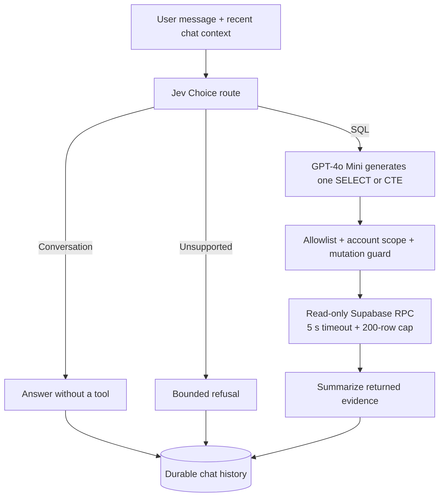

There is no RAG, embedding, Pinecone, or vector dependency. The assistant cannot send, delete, relabel, merge, or mutate mailbox data.

## Command Center operating modes

| Email scope | Result handling | Behavior |
| --- | --- | --- |
| New emails only | Preserve | Classifies emails without a successful result for the current classifier version |
| Entire mailbox | Keep history | Reclassifies every active email; previous runs remain and current corrections stay active |
| Entire mailbox | Drop old records + save fresh | Clears account-scoped classifications and human/AI overrides, then creates one fresh full-mailbox run |

Fresh replacement requires confirmation. It also removes manual application links/events and returns manually edited applications to deterministic ownership. Source Gmail data, drafts, private labels, and star anchors survive.

## Database migrations

| Migration | Purpose |
| --- | --- |
| `001_email_ingestion.sql` | Gmail accounts, emails, sync runs, and ingestion constraints |
| `002_classification_pipeline.sql` | Durable classification pipeline |
| `003_classification_bootstrap_keys.sql` | Idempotency and terminal immutability |
| `004_simplify_mvp_schema.sql` | Five-table classification core and `email_board` view |
| `005_corrections_and_reply_drafts.sql` | Current corrections and saved drafts |
| `006_application_lifecycle.sql` | Applications, message membership, lifecycle events, and board view |
| `007_operations_automation.sql` | Pipeline lease, scheduled health, and operational state |
| `008_ai_assistance.sql` | Stars and current structured AI review |
| `010_company_resolution_staging.sql` | Probabilistic company/title staging |
| `011_nl_sql_chat.sql` | Bounded read-only SQL executor |
| `012_promote_company_resolution.sql` | Audited high-confidence identity promotion |
| `013_ai_chat_history.sql` | Durable AI Chat conversations |
| `014_information_needed_category.sql` | Information Needed across classification and lifecycle constraints |
| `015_full_classification_reset.sql` | Account-scoped classification reset |
| `016_durable_application_stars.sql` | Email-anchored star continuity and atomic star RPC |
| `017_full_reset_application_overrides.sql` | Application-level manual override cleanup during full reset |

## Caching

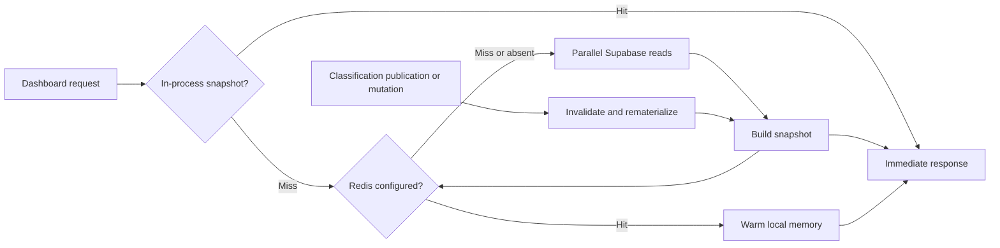

Set `REDIS_URL` to share snapshots across server processes. Without Redis, the application uses the same cache interface with in-process memory.

## Environment configuration

Use `.env.example` as the source of truth. Important groups:

- Supabase: `SUPABASE_URL`, `SUPABASE_SERVICE_ROLE_KEY`
- Redis: `REDIS_URL`
- Gmail: OAuth credentials, query, concurrency, request rate, retry count, and batch size
- Jev: API key, model, probability threshold, evaluation concurrency, and relationship thresholds
- OpenAI: API key, allowed models, and reply-writing profile
- Automation: interval, lock TTL, worker settings, and optional failure webhook

Never commit `.env`, `.gmail-token.json`, private labels, raw email exports, or API credentials.

## Development and verification

```bash
npm run typecheck
npm test
npm run check
```

The suite covers ingestion pagination and quota retry, parser normalization, sampling, classifier contracts, batch persistence, application grouping, relationship edge cases, ghosting, caches, analytics, AI review, read-only SQL safety, clean-reset behavior, and star continuity.

## Repository layout

```text
apps/
  dashboard/               Browser UI
  server/                  Local API and orchestration server
data/labeling/             Private labeling guidance and ignored generated data
lib/                       Domain logic, clients, policies, workers, and repositories
scripts/                   CLI entry points
supabase/migrations/       Ordered Postgres schema and RPC migrations
tests/                     Node test suite
IMPLEMENTATION_PLAN.md     Detailed decisions, acceptance criteria, and phase history
```

## Design invariants

- Gmail message ID is the durable external email identity.
- Service credentials remain server-side.
- A full Gmail scan is paginated; normal sync resumes from Gmail history.
- Jev outputs probabilities; code owns thresholds and side effects.
- Human correction, Jev judgment, and LLM review remain distinct.
- A Gmail thread alone never proves that two emails are the same application.
- Outreach cannot become ghosted without an established conversation.
- Feedback about an interview process is `other`, not `information_needed` or `interview_assessment`.
- Reply drafts are never sent automatically.
- AI Chat executes only validated, account-scoped, read-only SQL.
- Fresh replacement is explicit, complete-mailbox only, and preserves star intent through email anchors.

## Further documentation

See [IMPLEMENTATION_PLAN.md](IMPLEMENTATION_PLAN.md) for detailed acceptance criteria, historical measurements, migration decisions, and remaining operational notes.
